# 02 · Architecture

> **What this answers:** what are the subsystems, what do they own, and how do they connect?
> **Audience:** contributors first; consumers benefit from the map too.

---

## The big picture

```mermaid
flowchart TB
  Caller([Caller: app code, mix task, LiveView])

  subgraph EntryPoints [Entry points · lib/ex_athena.ex]
    Query[ExAthena.query/2]
    Stream[ExAthena.stream/3]
    Run[ExAthena.run/2]
    Extract[ExAthena.extract_structured/2]
  end

  Caller --> EntryPoints

  subgraph Kernel [Kernel · lib/ex_athena/loop]
    LoopMod[ExAthena.Loop]
    StateMod[Loop.State]
    TermMod[Loop.Terminations]
    EventsMod[Loop.Events]
    ParaMod[Loop.Parallel]
  end

  subgraph Strategy [Strategy · lib/ex_athena/modes]
    ModeBeh[Loop.Mode behaviour]
    ReAct[Modes.ReAct]
    PaS[Modes.PlanAndSolve]
    Refl[Modes.Reflexion]
  end

  subgraph IO [I/O · messages + tool-call protocol]
    Msgs[Messages · Message · ToolCall · ToolResult]
    CP[Messages.ContentPart<br/>multimodal]
    TC[ToolCalls · Native · TextTagged · RawJson]
  end

  subgraph Execution [Execution + safety]
    ToolBeh[Tool behaviour]
    ToolsReg[Tools registry]
    ToolCtx[ToolContext]
    Perm[Permissions]
    HooksMod[Hooks · 18 events]
    Tele[Telemetry]
  end

  subgraph Providers [Providers · lib/ex_athena/providers]
    ProvBeh[Provider behaviour]
    ReqLLM[Providers.ReqLLM<br/>ollama · openai · claude · gemini · llamacpp]
    Mock[Providers.Mock]
  end

  subgraph Persistence [Sessions + checkpoints]
    Session[Session GenServer]
    Store[Sessions.Store behaviour]
    Stores[InMemory · ETS · JSONL]
    Chk[Checkpoint + Sweeper]
  end

  subgraph Context [Context management]
    Compact[Compactor.Pipeline]
    Stages[5 stages:<br/>BudgetReduction · Snip · Microcompact · ContextCollapse · Summary]
    Memory[Memory · AGENTS.md / CLAUDE.md]
    Skills[Skills · SKILL.md lazy load]
  end

  subgraph Composition [Composition]
    Agents[Agents + Definition]
    Worktree[Agents.Worktree]
    Sidechain[Agents.Sidechain<br/>transcript persistence]
    Spawn[Tools.SpawnAgent]
  end

  subgraph External [External integrations]
    MCP[MCP client · stdio · http]
    LSP[LSP client + diagnostics]
  end

  subgraph UIs [Interactive UIs]
    TUI[Chat.Tui · REPL]
    Web[Web.* · Phoenix LiveView]
  end

  Run --> LoopMod
  Stream --> ReqLLM
  Query --> ReqLLM
  Extract --> LoopMod

  LoopMod --> StateMod
  LoopMod --> TermMod
  LoopMod --> ModeBeh
  LoopMod --> Compact
  LoopMod --> HooksMod
  LoopMod --> Memory
  LoopMod --> Skills

  ModeBeh -.implements.-> ReAct
  ModeBeh -.implements.-> PaS
  ModeBeh -.implements.-> Refl

  ReAct --> ProvBeh
  ReAct --> TC
  ReAct --> Perm
  ReAct --> ToolsReg
  ReAct --> ParaMod

  ProvBeh -.implements.-> ReqLLM
  ProvBeh -.implements.-> Mock

  ToolsReg --> ToolBeh
  ToolsReg --> MCP
  ToolBeh -.uses.-> ToolCtx

  Compact --> Stages
  Spawn --> LoopMod
  Spawn --> Worktree
  Spawn --> Sidechain

  Session --> LoopMod
  Session --> Store
  Store -.implements.-> Stores
  Session --> Chk

  TUI --> Session
  Web --> Session

  classDef kernel fill:#fde68a,stroke:#92400e;
  classDef strategy fill:#bfdbfe,stroke:#1e40af;
  classDef drivers fill:#bbf7d0,stroke:#065f46;
  classDef io fill:#e9d5ff,stroke:#6b21a8;
  classDef ui fill:#fbcfe8,stroke:#9f1239;
  class Kernel kernel
  class Strategy strategy
  class Providers,Execution,Persistence,Context,External,Composition drivers
  class IO io
  class UIs ui
```

---

## Subsystems at a glance

### Kernel ([`lib/ex_athena/loop/`](../lib/ex_athena/loop))

| Module | Role |
|---|---|
| [`ExAthena.Loop`](../lib/ex_athena/loop.ex) | The agent-loop kernel — entry point `run/2`, the iteration cap / budget / mistake gates, reactive recompaction. |
| [`Loop.State`](../lib/ex_athena/loop/state.ex) | Opaque state threaded through every iteration. ~25 fields covering messages, caps, counters, mode state, session ids. |
| [`Loop.Terminations`](../lib/ex_athena/loop/terminations.ex) | 12 typed finish reasons + `category/1` (`:success | :retryable | :capacity | :fatal`). |
| [`Loop.Events`](../lib/ex_athena/loop/events.ex) | Flat-tuple events emitted to the optional `:on_event` callback. |
| [`Loop.Parallel`](../lib/ex_athena/loop/parallel.ex) | Batches parallel-safe tool calls via `Task.async_stream`; serializes mutators. |

Deep dive → [03 · Reasoning loop](03-reasoning-loop.md) · [05 · State & termination](05-state-and-termination.md).

### Strategy ([`lib/ex_athena/modes/`](../lib/ex_athena/modes))

| Module | Role |
|---|---|
| [`Loop.Mode`](../lib/ex_athena/loop/mode.ex) | Behaviour: `init/1`, `iterate/1`, optional `productivity_signal/2`. |
| [`Modes.ReAct`](../lib/ex_athena/modes/react.ex) | Default — Reason → Act → Observe → repeat. Real-time streaming, native + TextTagged tool calls. |
| [`Modes.PlanAndSolve`](../lib/ex_athena/modes/plan_and_solve.ex) | Plan once → execute many iterations. |
| [`Modes.Reflexion`](../lib/ex_athena/modes/reflexion.ex) | Attempt → critique → retry. |

Deep dive → [04 · Modes](04-modes.md).

### I/O ([`lib/ex_athena/messages*`](../lib/ex_athena/messages.ex) + [`tool_calls*`](../lib/ex_athena/tool_calls.ex))

| Module | Role |
|---|---|
| [`ExAthena.Messages`](../lib/ex_athena/messages.ex) | Canonical `Message`, `ToolCall`, `ToolResult` structs + constructors. |
| [`Messages.ContentPart`](../lib/ex_athena/messages/content_part.ex) | Multimodal — inline images, image URLs, files. |
| [`ExAthena.ToolCalls`](../lib/ex_athena/tool_calls.ex) | Tier-cascading parser — Native → TextTagged → RawJson → empty. |
| [`ToolCalls.Native`](../lib/ex_athena/tool_calls/native.ex) | OpenAI / Anthropic / Ollama-OAI tool_calls array. |
| [`ToolCalls.TextTagged`](../lib/ex_athena/tool_calls/text_tagged.ex) | `~~~tool_call <json> ~~~` fence fallback. |
| [`ToolCalls.RawJson`](../lib/ex_athena/tool_calls/raw_json.ex) | Bare-JSON `{"name":…, "arguments":…}` for weak models. |

Deep dive → [06 · Messages & tool calls](06-messages-and-tool-calls.md).

### Execution + safety

| Module | Role |
|---|---|
| [`ExAthena.Tool`](../lib/ex_athena/tool.ex) | Behaviour: `name/0`, `description/0`, `schema/0`, `execute/2`, optional `parallel_safe?/0`. |
| [`ExAthena.Tools`](../lib/ex_athena/tools.ex) | Resolver — builtins + MCP servers unified into one spec list. |
| [`ExAthena.ToolContext`](../lib/ex_athena/tool_context.ex) | Threaded to every `execute/2`: `cwd`, `phase`, `session_id`, `assigns`. |
| [`ExAthena.Permissions`](../lib/ex_athena/permissions.ex) | Deny-first gate — `disallowed → allowed → phase → can_use_tool`. |
| [`ExAthena.Hooks`](../lib/ex_athena/hooks.ex) | 18 lifecycle events with intercept / inject / transform / deny / halt semantics. |
| [`ExAthena.Telemetry`](../lib/ex_athena/telemetry.ex) | `:telemetry` spans + events. |

Deep dives → [07 · Tools](07-tools.md) · [08 · Permissions](08-permissions.md) · [09 · Hooks](09-hooks.md).

### Providers ([`lib/ex_athena/providers/`](../lib/ex_athena/providers))

| Module | Role |
|---|---|
| [`ExAthena.Provider`](../lib/ex_athena/provider.ex) | Behaviour: `query/2`, optional `stream/3`, `capabilities/0`. |
| [`Providers.ReqLLM`](../lib/ex_athena/providers/req_llm.ex) | Multi-backend via `req_llm` — `:ollama`, `:openai_compatible`, `:claude`, `:gemini`, `:llamacpp`. |
| [`Providers.Mock`](../lib/ex_athena/providers/mock.ex) | Test double — scripted responses. |
| [`ExAthena.Capabilities`](../lib/ex_athena/capabilities.ex) | Capability-map shape (`max_tokens`, `native_tool_calls`, `streaming`, …). |

Deep dive → [10 · Providers](10-providers.md).

### Persistence

| Module | Role |
|---|---|
| [`ExAthena.Session`](../lib/ex_athena/session.ex) | GenServer wrapping Loop for stateful chat. |
| [`Sessions.Store`](../lib/ex_athena/sessions/store.ex) | Behaviour for event-log persistence. |
| [`Sessions.SchemaStore`](../lib/ex_athena/sessions/schema_store.ex) | ETS row-table tracking. |
| `Sessions.Stores.{InMemory,Ets,Jsonl}` | Three stock backends. |
| [`ExAthena.Checkpoint`](../lib/ex_athena/checkpoint.ex) + sweeper | File snapshots tied to message-log truncation for rewind. |

Deep dive → [11 · Sessions](11-sessions.md).

### Context management

| Module | Role |
|---|---|
| [`ExAthena.Compactor`](../lib/ex_athena/compactor.ex) | Behaviour: `compact/2`, optional `should_compact?/2`. |
| [`Compactor.Pipeline`](../lib/ex_athena/compactor/pipeline.ex) | Default 5-stage orchestration. |
| `Compactors.{BudgetReduction,Snip,Microcompact,ContextCollapse,Summary}` | The five stages. |
| [`ExAthena.Memory`](../lib/ex_athena/memory.ex) | Discover and prepend `AGENTS.md` / `CLAUDE.md` from cwd + `~/.config/ex_athena/`. |
| [`ExAthena.Skills`](../lib/ex_athena/skills.ex) | Discover `SKILL.md`; emit 50-token descriptors; lazy-load on a `skill` tool call or a `[skill: name]` sentinel. |

Deep dives → [12 · Compaction](12-compaction.md) · [14 · Memory & skills](14-memory-and-skills.md).

### Composition

| Module | Role |
|---|---|
| [`ExAthena.Agents`](../lib/ex_athena/agents.ex) | Custom agent definitions from `.exathena/agents/<name>.md`. |
| [`Agents.Definition`](../lib/ex_athena/agents/definition.ex) | Parsed agent: tools, permissions, mode, system prompt. |
| [`Agents.Worktree`](../lib/ex_athena/agents/worktree.ex) | Git worktree isolation per subagent. |
| [`Agents.WorktreeSweeper`](../lib/ex_athena/agents/worktree_sweeper.ex) | Cleanup of stale worktrees. |
| [`Agents.Sidechain`](../lib/ex_athena/agents/sidechain.ex) | Subagent transcript persistence. |
| [`Tools.SpawnAgent`](../lib/ex_athena/tools/spawn_agent.ex) | The tool that lets one agent invoke another. |

Deep dive → [13 · Agents & subagents](13-agents-and-subagents.md).

### External integrations

| Module | Role |
|---|---|
| [`ExAthena.Mcp`](../lib/ex_athena/mcp.ex) + [`mcp/*`](../lib/ex_athena/mcp) | MCP client — protocol, stdio/HTTP transports, registry, supervisor. |
| [`ExAthena.Lsp`](../lib/ex_athena/lsp.ex) + [`lsp/*`](../lib/ex_athena/lsp) | LSP client + implicit-diagnostics hook. |

Deep dive → [15 · MCP & LSP](15-mcp-and-lsp.md).

### Interactive UIs

| Module | Role |
|---|---|
| [`Chat.Tui`](../lib/ex_athena/chat/tui.ex) | Terminal REPL via `ex_ratatui`. Slash commands (`/model`, `/mode`, `/tools`, …). |
| [`Web.*`](../lib/ex_athena/web) | Phoenix LiveView UI — session recall, fork, diff viewer. |

---

## Contributor notes

- **Cross-layer rules**: Modes never reach into Drivers directly except through the abstractions in their layer (`Permissions.check/3`, `Hooks.run_pre_tool_use/4`, `Tool.execute/2`, `Provider.query/2`). The kernel never reaches into a specific Mode — only via the `Loop.Mode` behaviour.
- **State is opaque**: only `Loop.Mode` implementations touch `Loop.State` fields. Consumers see `ExAthena.Result` (`lib/ex_athena/result.ex`).
- **Tools are stateless**: anything stateful sits in `ctx.assigns` or in a process the tool owns (e.g. LSP client, MCP server). The Loop owns lifecycle.
- **Behaviour-based extension**: every layer-crossing edge in the diagram above is a `@behaviour`. Adding a new Mode / Provider / Tool / Compactor / Store means implementing the corresponding behaviour and registering it.
