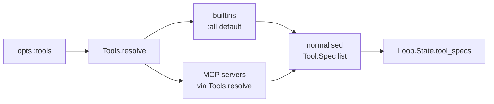
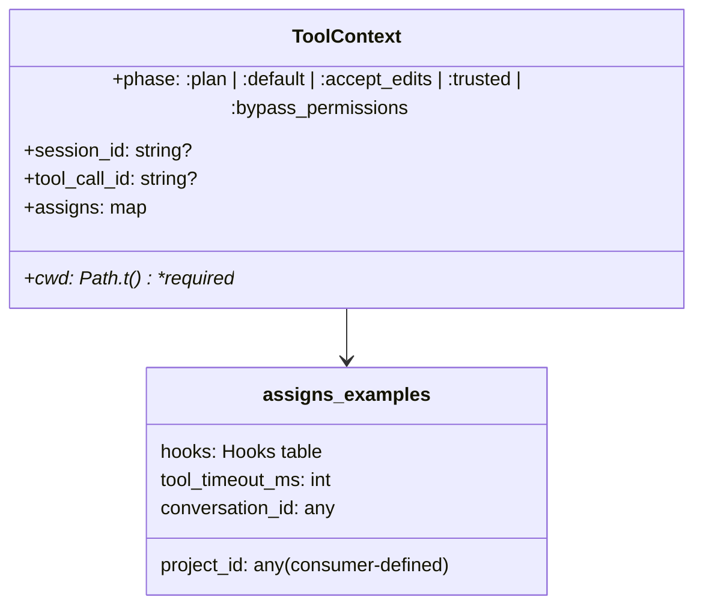
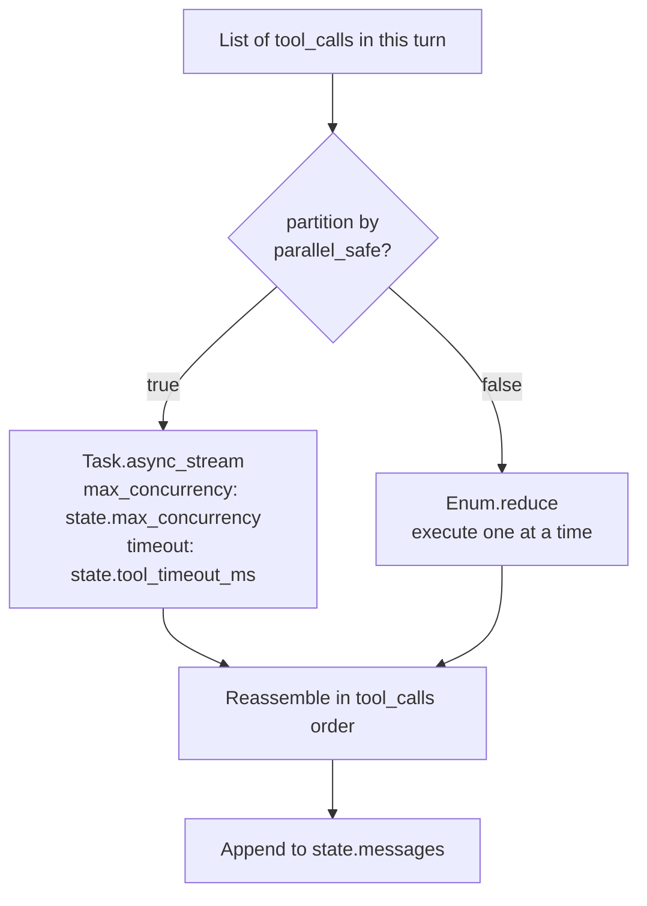

# 07 · Tools

> **What this answers:** how does a tool get from "model emitted a tool_call" to "tool_result appended to history"? What's parallel-safe? How does `ToolContext` thread through?
> **Audience:** consumers writing custom tools; contributors maintaining builtins.

---

## One tool call, end to end

```mermaid
sequenceDiagram
  autonumber
  participant M as Mode
  participant Par as Loop.Parallel
  participant Perm as Permissions
  participant H as Hooks
  participant T as Tool
  participant Ctx as ToolContext

  M->>Par: run(tool_calls, state, &run_single_tool_call/2)
  Par->>Par: split parallel-safe vs mutating
  par for each parallel-safe call (concurrent)
    Par->>Perm: check(tc, ctx, opts)
    alt allowed
      Par->>H: PreToolUse(tc.name, args, tc.id)
      H-->>Par: :ok | {:deny,r} | {:halt,r}
      Par->>T: Tool.execute(args, ctx with tool_call_id)
      Note over T: Tool reads from ctx.cwd, ctx.assigns
      T-->>Par: {:ok,r} | {:error,r} | {:halt,r}
      Par->>H: PostToolUse(result, tc.id)
      H-->>Par: :ok | {:augment,t} | {:halt,r}
    else denied
      Par->>Par: synth deny tool_result, ++ consecutive_mistakes
    end
  and for each mutator (serialized)
    Par->>Perm: check
    Par->>T: execute
  end
  Par-->>M: {:ok, [tool_result_messages], state}
```

Source: [`ExAthena.Loop.Parallel.run/3`](../lib/ex_athena/loop/parallel.ex), [`ExAthena.Modes.ReAct.run_single_tool_call/2`](../lib/ex_athena/modes/react.ex).

---

## The Tool behaviour

```elixir
@behaviour ExAthena.Tool

@impl true
def name(),         do: "read"
@impl true
def description(),  do: "Read a file from disk."
@impl true
def schema(),       do: %{type: "object", properties: %{file_path: %{type: "string"}}, required: ["file_path"]}
@impl true
def execute(%{"file_path" => p}, ctx) do
  with {:ok, abs} <- ExAthena.ToolContext.resolve_path(ctx, p),
       {:ok, body} <- File.read(abs) do
    {:ok, body}
  end
end
@impl true
def parallel_safe?(), do: true  # optional; defaults to false
```

Source: [`lib/ex_athena/tool.ex`](../lib/ex_athena/tool.ex). Return shapes:

| Return | Effect |
|---|---|
| `{:ok, result}` | Result stringified, appended as tool_result. Resets `consecutive_mistakes` for this turn. |
| `{:error, reason}` | Appended as error tool_result (`is_error: true`). Increments `consecutive_mistakes`. |
| `{:halt, reason}` | Loop terminates immediately with `:error_halted`; `halted_reason` populated. |

Tools may also return `{:ok, result, %{kind: …, payload: …}}` to include a `ui_payload` (rendered by hosts; not seen by the LLM). See `Messages.ToolResult`.

---

## Built-in tools

All live in [`lib/ex_athena/tools/`](../lib/ex_athena/tools).

| Tool | `name` | Purpose | `parallel_safe?` |
|---|---|---|---|
| [`Tools.Read`](../lib/ex_athena/tools/read.ex) | `read` | Read a file. | ✅ |
| [`Tools.Glob`](../lib/ex_athena/tools/glob.ex) | `glob` | Pattern-match paths. | ✅ |
| [`Tools.Grep`](../lib/ex_athena/tools/grep.ex) | `grep` | Search file contents. | ✅ |
| [`Tools.WebFetch`](../lib/ex_athena/tools/web_fetch.ex) | `web_fetch` | HTTP GET → text. | ✅ |
| [`Tools.WebSearch`](../lib/ex_athena/tools/web_search.ex) | `web_search` | Web search (pluggable backend: DuckDuckGo / Tavily / Brave / SearXNG). | ✅ |
| [`Tools.UsageRules`](../lib/ex_athena/tools/usage_rules.ex) | `usage_rules` | Read a dependency's local `usage-rules.md` docs. | ✅ |
| [`Tools.PlanMode`](../lib/ex_athena/tools/plan_mode.ex) | `plan_mode` | Capture / present a plan. | ✅ |
| [`Tools.SpawnAgent`](../lib/ex_athena/tools/spawn_agent.ex) | `spawn_agent` | Run a subagent. | ✅ |
| [`Tools.Lsp`](../lib/ex_athena/tools/lsp.ex) | `lsp` | LSP queries (definition, references, diagnostics). | ✅ |
| [`Tools.Write`](../lib/ex_athena/tools/write.ex) | `write` | Write a file. | ❌ |
| [`Tools.Edit`](../lib/ex_athena/tools/edit.ex) | `edit` | Targeted in-place edit. | ❌ |
| [`Tools.ApplyPatch`](../lib/ex_athena/tools/apply_patch.ex) | `apply_patch` | Apply a unified diff. | ❌ |
| [`Tools.Bash`](../lib/ex_athena/tools/bash.ex) | `bash` | Run a shell command. | ❌ |
| [`Tools.TodoWrite`](../lib/ex_athena/tools/todo_write.ex) | `todo_write` | Update task list. | ❌ |

Cross-link: [`guides/tools.md`](../guides/tools.md) — schemas, error modes, `ui_payload` formats.

---

## Tool resolution



[`Tools.resolve/1`](../lib/ex_athena/tools.ex) accepts:

- `:all` (default) — all builtins
- `[module()]` — explicit modules; can mix builtins + custom + MCP-backed
- `nil` — falls back to `config :ex_athena, :tools`

Whatever you pass becomes the canonical `Tool.Spec` list ([`lib/ex_athena/tool/spec.ex`](../lib/ex_athena/tool/spec.ex)) used for native tool-call schemas and TextTagged augmentation.

---

## ToolContext — what tools see



Source: [`lib/ex_athena/tool_context.ex`](../lib/ex_athena/tool_context.ex).

- **`cwd`** — every filesystem tool uses this as root. Use [`ToolContext.resolve_path/2`](../lib/ex_athena/tool_context.ex#L40), which rejects `..` traversal and null bytes.
- **`allowed_roots`** — confinement. `nil` (default) = unconfined: relative paths resolve against `cwd`, absolute paths pass through. A list of absolute dirs = **confined**: filesystem tools may only touch paths inside a root (absolute escapes like `/etc/passwd` and `../secret` are rejected) and Bash runs under an OS sandbox restricted to the roots. Set via `confine: true` (→ `[cwd]`) or `allowed_roots: [...]` on `ExAthena.run/2`; the web UI and TUI turn it on by default (`EX_ATHENA_CONFINE=0` to disable). Note `web_fetch`'s SSRF guard (refuse private/loopback/link-local hosts, on the initial URL and every redirect hop) is **always on regardless of confinement** — opt out per run with `allow_local_hosts: true` on `ExAthena.run/2`.
- **`confine_mode`** — what Bash does when the run is confined but the host has no OS sandbox helper (`sandbox-exec` on macOS, `bwrap` on Linux). `:enforced` (default for every confined run) **fails closed**: the command is refused with `{:error, {:sandbox_unavailable, helper}}` instead of silently running unconfined. `confine: :best_effort` on `ExAthena.run/2` opts into degradation: the command runs unconfined with a logged warning. Both paths emit an `[:ex_athena, :sandbox, :unavailable]` telemetry event (`meta.outcome` `:denied` / `:ran_unconfined`). Irrelevant when unconfined.
- **`phase`** — read in tools that gate themselves further (rare; permissions usually handle this).
- **`session_id`** — propagate to subagents, sidechain transcripts, telemetry.
- **`tool_call_id`** — populated per-call so tools can correlate. Used by SpawnAgent for sidechain naming.
- **`assigns`** — open extension. The kernel pre-populates `hooks` (so SpawnAgent can fire `SubagentStart/Stop`) and `tool_timeout_ms`. Consumers add `project_id`, `request_id`, etc.

---

## Parallel-safe batching



Default `max_concurrency: 4`, `tool_timeout_ms: 60_000`. Override via `Loop.run` options.

A tool is **safe to run concurrently** when it doesn't mutate the world (or its mutations are commutative and isolated). Read, Glob, Grep, WebFetch, LSP, PlanMode, SpawnAgent (which spawns *its own* subagent loop), and Edit/Write/Bash MUST return `parallel_safe?: false` so the runtime preserves their declared order.

> Defaults to `false` (conservative) when the callback isn't implemented. See [`Tool.parallel_safe?/0`](../lib/ex_athena/tool.ex#L74).

---

## Writing a custom tool

```elixir
defmodule MyApp.Tools.Linear do
  @behaviour ExAthena.Tool

  @impl true
  def name, do: "linear"
  @impl true
  def description, do: "Query Linear: list issues by team, create issues, post comments."

  @impl true
  def schema do
    %{
      type: "object",
      properties: %{
        action: %{type: "string", enum: ["list", "create", "comment"]},
        team: %{type: "string"},
        title: %{type: "string"},
        body: %{type: "string"},
        issue_id: %{type: "string"}
      },
      required: ["action"]
    }
  end

  @impl true
  def execute(%{"action" => "list", "team" => team}, ctx) do
    api_key = ctx.assigns[:linear_api_key] || raise "missing :linear_api_key in assigns"
    # … fetch via Req
    {:ok, summary, %{kind: :linear_issues, payload: %{issues: issues}}}
  end

  def execute(%{"action" => "create"} = args, ctx) do
    # … create → text + ui_payload
  end

  @impl true
  def parallel_safe?, do: false  # writes
end
```

Wire it up:

```elixir
ExAthena.run(prompt,
  tools: [MyApp.Tools.Linear, ExAthena.Tools.Read, ExAthena.Tools.Grep],
  assigns: %{linear_api_key: System.fetch_env!("LINEAR_API_KEY")}
)
```

---

## Contributor notes

- **Stateless tools, stateful resources**: tools are modules, not processes. Anything stateful (connection pools, MCP clients, LSP clients) lives in a process the tool calls into via `ctx.assigns` or a Registry.
- **`ctx.cwd` is load-bearing**: every filesystem tool resolves relative paths against it via `ToolContext.resolve_path/2`. Don't `File.read!(path)` blindly — that bypasses traversal protection.
- **Hooks fire around `execute/2`**: tools shouldn't fire their own lifecycle hooks. The Mode handles `PreToolUse` / `PostToolUse` invariably. SpawnAgent is the exception (it fires `SubagentStart` / `SubagentStop` because the parent's Mode can't observe the subagent's life).
- **`{:halt, reason}` is rare**: prefer `{:error, reason}` so the model can recover. Use `:halt` only when the session must end (budget exhausted, sandbox violation, hook said so).
- **Stringification**: non-string `{:ok, …}` results are stringified for the model. Pass `ui_payload` for rich UI without text-encoding everything.
- **Timeout**: tool execution is wrapped with `Task.yield(t, ctx.assigns[:tool_timeout_ms])`. A timeout becomes an `{:error, :timeout}` tool_result, *not* a halt — the model can retry or try a different tool.

---

## Where to go next

- [08 · Permissions](08-permissions.md) — the gate before `execute/2`.
- [09 · Hooks](09-hooks.md) — what `PreToolUse` / `PostToolUse` can do.
- [13 · Agents & subagents](13-agents-and-subagents.md) — how `SpawnAgent` lays out a child loop.
- [15 · MCP & LSP](15-mcp-and-lsp.md) — external-server tools.
