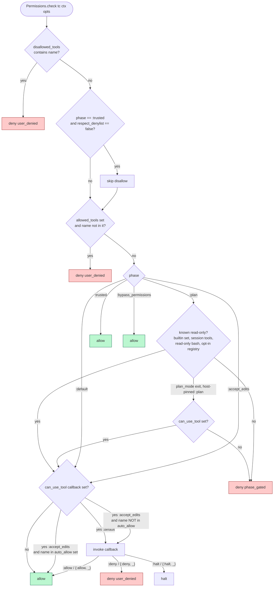
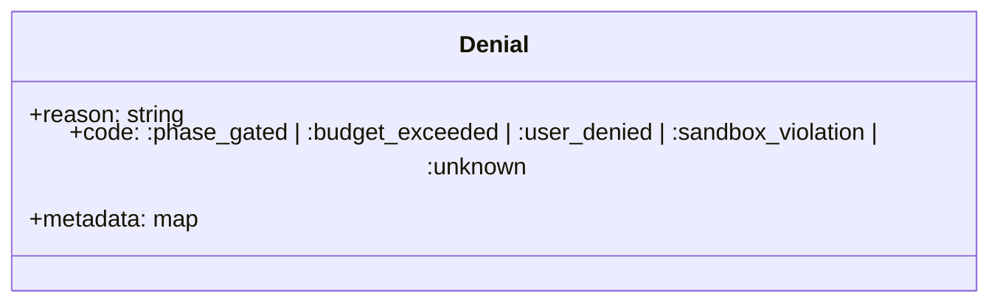
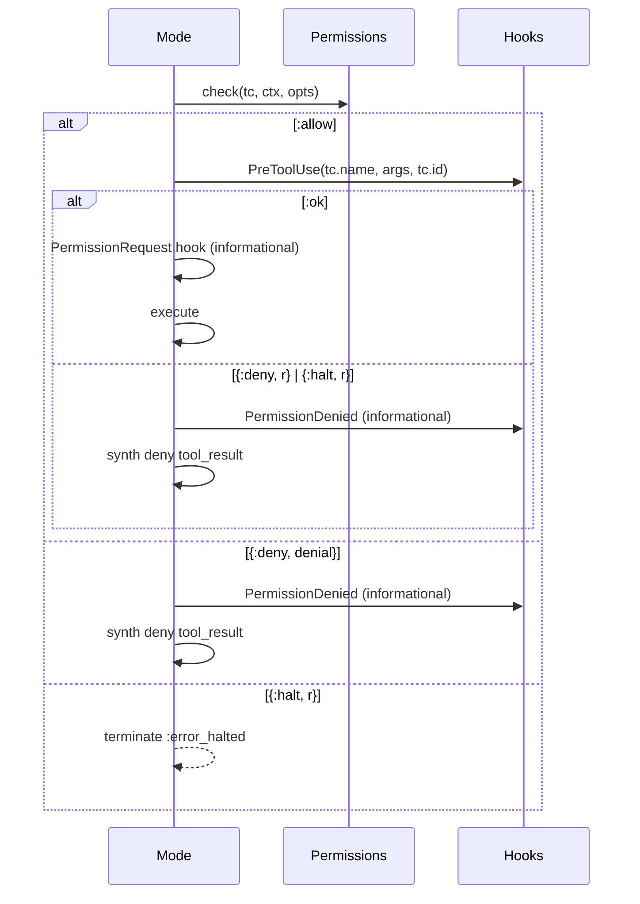

# 08 · Permissions — The Deny-First Gate

> **What this answers:** how does ExAthena decide whether a tool call is allowed? What's a "phase"? When does the `can_use_tool` callback fire?
> **Audience:** consumers configuring safety; contributors maintaining the gate.

---

## The check chain



Source: [`ExAthena.Permissions.check/3`](../lib/ex_athena/permissions.ex#L126).

**Deny-first ordering**: `disallowed → allowed → phase → callback`. First decisive answer wins.

The denylist is the user's "absolutely never" list — it survives even `:bypass_permissions`. The only escape hatch is `:trusted` with `respect_denylist: false`, intended for *very* trusted automation contexts.

---

## The five phases

| Phase | Read-only tools | Write/edit/bash | `can_use_tool` consulted | Use case |
|---|---|---|---|---|
| `:plan` | ✅ | ❌ phase_gated — **deny-by-default** for anything not known read-only (`todo_write`/`ask_user`/`finish` ✅) | only if not auto-allowed | Read-only investigation before code changes. Mirrors the agent's "plan mode." Session-control tools are allowed — they mutate only session bookkeeping, so orchestrate planning and read-only workers can record their plan, ask the user, and finish. Custom/MCP tools are denied unless they opt in as read-only. |
| `:default` | ✅ | ✅ via callback | ✅ for everything | Interactive sessions where the user approves writes one-by-one. |
| `:accept_edits` | ✅ | ✅ for write/edit/todo_write/read/glob/grep/web_fetch/plan_mode/spawn_agent | ✅ for everything else (bash, custom) | "Edits are pre-approved" — file mutations auto-allow; shell + custom still ask. |
| `:trusted` | ✅ | ✅ | ❌ (always allow) | Trusted automation; denylist still wins unless `respect_denylist: false`. |
| `:bypass_permissions` | ✅ | ✅ | ❌ | Test harnesses, sandboxed runners. Denylist still wins. |

Phase comes from `ctx.phase` (which the Loop sets from `opts[:phase]`, default `:default`).

### Read-only tools (allowed in `:plan`)

From [`@readonly_tools`](../lib/ex_athena/permissions.ex#L100):
`read`, `glob`, `grep`, `web_fetch`, `web_search`, `usage_rules`, `plan_mode`, `spawn_agent`, `lsp`.

Session-control tools (`@session_tools`: `todo_write`, `ask_user`, `finish`)
are also allowed — they mutate only session bookkeeping (the todo list, a
question to the user, ending the run), never the workspace.

`bash` is conditionally allowed: only commands the allowlist classifier in
[`ExAthena.Tools.Bash.read_only_command?/1`](../lib/ex_athena/tools/bash.ex)
recognises as read-only (`cat`, `ls`, `grep`, `git log`, `gh issue view`, …).
Unknown commands — including interpreter one-liners (`python -c`, `perl -e`,
`ruby -e`, `node -e`, `ex`/`ed`), command substitution, and file redirects —
are treated as mutating and denied. The classifier gates the `:plan` phase
only; the OS sandbox (`ExAthena.Sandbox`) independently enforces write
confinement for confined runs — and when the sandbox helper is missing on the
host, confined `bash` **fails closed** (refuses with
`{:sandbox_unavailable, helper}`) unless the run opted into
`confine: :best_effort`.

### Everything else (denied in `:plan` by default)

`write`, `edit`, `apply_patch`, non-read-only `bash`, and **every custom,
host, or MCP tool not known to be read-only** are denied with
`code: :phase_gated`. Read-only custom tools opt in through any of:

- the optional `read_only?/0` callback on the `ExAthena.Tool` module
  (cached on `Tool.Spec`),
- the standard MCP `annotations.readOnlyHint` on the tool's `tools/list`
  entry,
- the `readonly_tools: ["name", …]` option on `ExAthena.Loop.run/2`.

### Exiting plan mode (`plan_mode` `"exit"`)

Leaving `:plan` is a privilege escalation, gated on *who* imposed the phase:

- Run **started** in `:plan` (host-pinned): the `plan_mode` exit call itself
  must be approved through `can_use_tool` (one prompt, on the same path as
  every other sensitive tool). With **no callback configured, exit is
  denied** — the host confined the run to read-only and left no approval
  channel, so only the host can lift the restriction.
- Model entered `:plan` itself from a looser phase: exiting restores the
  host's original grant and needs no approval.

The `phase_transition` sentinel is honoured by the loop **only** when it
comes from the `plan_mode` tool — a custom/MCP tool returning the same
payload shape cannot switch phases.

### Auto-allowed in `:accept_edits`

From [`@auto_allow_in_accept_edits`](../lib/ex_athena/permissions.ex#L105):
`read`, `glob`, `grep`, `web_fetch`, `plan_mode`, `spawn_agent`, `write`, `edit`, `todo_write`.

(Note: `bash` is **not** auto-allowed in `:accept_edits` — it still consults the callback. Custom tools are also gated.)

---

## The `can_use_tool` callback

```elixir
ExAthena.run(prompt,
  phase: :default,
  can_use_tool: fn name, args, ctx ->
    cond do
      name == "bash" and dangerous?(args["command"]) -> {:deny, "Won't run rm -rf"}
      name == "web_fetch" -> :allow
      true -> ask_user(name, args)
    end
  end
)
```

Callback signature:

```elixir
(name :: String.t(), arguments :: map(), ctx :: ToolContext.t()) ->
  :allow | {:allow, term()} |
  :deny  | {:deny, %Denial{}} | {:deny, term()} |
  :halt  | {:halt, term()}
```

Returns are normalised by [`normalize/1`](../lib/ex_athena/permissions.ex#L234):

- `:allow` / `{:allow, _}` → `:allow`
- `:deny` → `{:deny, %Denial{code: :user_denied}}`
- `{:deny, %Denial{}}` → passed through
- `{:deny, term}` → wrapped in `Denial{code: :user_denied, metadata: %{raw: term}}`
- `:halt` / `{:halt, _}` → terminates the loop with `:error_halted`
- anything else → `{:deny, %Denial{code: :unknown}}`

---

## The Denial struct



Source: [`Permissions.Denial`](../lib/ex_athena/permissions.ex#L1).

Codes:

| Code | Meaning |
|---|---|
| `:phase_gated` | Tool blocked by phase (e.g. write in `:plan`). |
| `:budget_exceeded` | Budget check killed it (reserved). |
| `:user_denied` | Denylist, allowlist, or `can_use_tool` returned `:deny`. |
| `:sandbox_violation` | Sandbox / worktree boundary violated. |
| `:unknown` | Callback returned something unexpected. |

`metadata` often carries `requested_tool`, `allowed_tools`, `phase`, and any raw `:deny` reason under `metadata.raw`. The `String.Chars` impl returns `reason`, so `to_string(denial)` still works for legacy callers.

---

## Permissions and hooks

The Mode wraps a tool call in three checks:



`PermissionRequest` and `PermissionDenied` are informational lifecycle events. They can't reverse the decision (the gate already ran), but they're useful for logging and audit.

---

## Examples

### Read-only investigation (`:plan`)

```elixir
ExAthena.run("Find every place we open the DB", phase: :plan)
# bash, write, edit all denied with code: :phase_gated (todo_write is allowed).
```

### Code-mod session with auto-write

```elixir
ExAthena.run("Rename Foo to Bar throughout the repo",
  phase: :accept_edits,
  can_use_tool: fn
    "bash", %{"command" => "git " <> _}, _ -> :allow
    "bash", _, _ -> {:deny, "Shell only allowed for git in this session"}
    _, _, _ -> :allow
  end
)
```

### Hard-deny denylist that survives bypass

```elixir
ExAthena.run("Do whatever you need to",
  phase: :bypass_permissions,
  disallowed_tools: ["bash"]   # still wins
)
```

### Trusted automation (skip the denylist too)

```elixir
ExAthena.run("Run the nightly migration",
  phase: :trusted,
  respect_denylist: false
)
```

---

## Contributor notes

- **Deny-first ordering is a hard invariant**: never swap the order in `check/4`. Tests in [`test/ex_athena/permissions_test.exs`](../test/ex_athena/permissions_test.exs) enforce it.
- **`:auto` is reserved**: do not introduce a phase named `:auto`. It's reserved for the future ML-classifier mode (Claude Code paper terminology).
- **Phase ≠ permission**: phase is the *prevailing posture*. The denylist is *user veto*. Don't conflate them in error messages.
- **The callback gets `ctx`**: include `ctx.session_id` and `ctx.assigns` when you need to consult the session's UI for an approval — that's why `ToolContext` is the third arg.
- **Halt vs deny**: returning `:halt` from the callback stops the entire run. Reserve it for "user closed the dialog" or "operator killed the session." Deny just blocks this call and lets the model try something else.

---

## Where to go next

- [`guides/permissions.md`](../guides/permissions.md) — practical setup and callback patterns.
- [09 · Hooks](09-hooks.md) — `PermissionRequest`, `PermissionDenied`, `ToolDenied` informational events.
- [13 · Agents & subagents](13-agents-and-subagents.md) — agents can override phase / allowlist per subagent.
