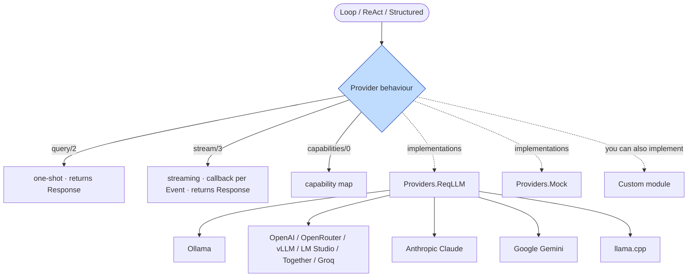
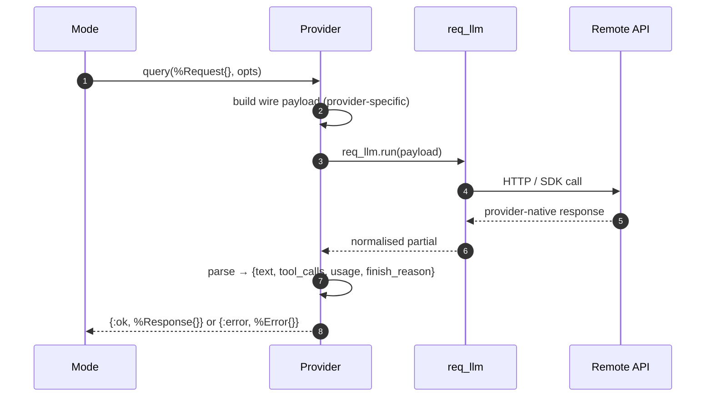
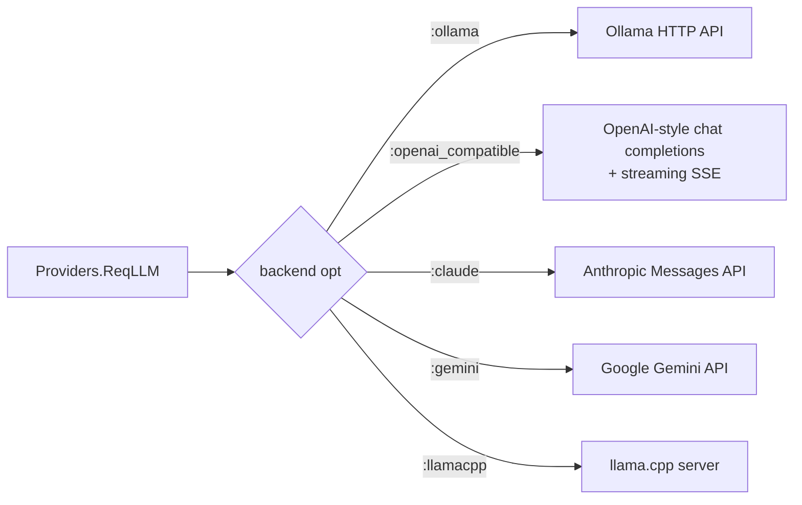

# 10 · Providers — Talking to LLMs

> **What this answers:** how does ExAthena run the same agent code across Ollama / OpenAI / Claude / Gemini / llamacpp? What does the `Provider` behaviour guarantee?
> **Audience:** consumers configuring providers; contributors adding a new backend.

---

## The provider abstraction



Source: [`ExAthena.Provider`](../lib/ex_athena/provider.ex). The contract:

```elixir
@callback query(Request.t(), keyword()) :: {:ok, Response.t()} | {:error, term()}
@callback stream(Request.t(), (Streaming.Event.t() -> term()), keyword()) ::
            {:ok, Response.t()} | {:error, term()}
@callback capabilities() :: Capabilities.t()
@callback embed(String.t() | [String.t()], keyword()) ::
            {:ok, Embedding.t()} | {:error, term()}

@optional_callbacks [stream: 3, capabilities: 1, list_models: 0, embed: 2]
```

The Loop calls `stream/3` when `:on_event` is set, `query/2` otherwise.

`embed/2` sits outside the loop — it serves `ExAthena.embed/2` for retrieval
layers, not inference. It is optional because not every provider is an
inference endpoint (`:claude_code` is a self-contained agent CLI); providers
that implement it advertise `embeddings: true` so callers can feature-detect
before building on it. See the [Embeddings guide](../guides/embeddings.md).

---

## Request → Response normalisation



`Request`, `Response`, `Streaming.Event`, and `Error` are the canonical types ([`lib/ex_athena/request.ex`](../lib/ex_athena/request.ex), [`response.ex`](../lib/ex_athena/response.ex), [`streaming.ex`](../lib/ex_athena/streaming.ex), [`error.ex`](../lib/ex_athena/error.ex)).

A `Response` carries `text`, `tool_calls`, `usage`, `cost_usd`, `finish_reason`, `model`, `provider`. Streaming `Event`s flow as deltas while accumulating into the same final `Response`.

---

## Capabilities

Every provider declares a capabilities map at compile time:

```elixir
%{
  max_tokens: 128_000,
  native_tool_calls: true,
  streaming: true,
  multimodal: %{image_inline: true, image_url: true, file: false},
  supports_response_format_json_schema: true,
  …
}
```

Source schema: [`lib/ex_athena/capabilities.ex`](../lib/ex_athena/capabilities.ex).

The Loop reads these to decide:

- **Tool-call parser tier**: `native_tool_calls: false` triggers TextTagged augmentation ([06](06-messages-and-tool-calls.md)).
- **Compaction trigger**: `max_tokens` feeds the estimate ([12](12-compaction.md)).
- **Multimodal forwarding**: which `ContentPart` types are passed through vs. text-encoded.
- **Streaming**: `stream/3` is only attempted when `streaming: true`.

Pass `capabilities: %{…}` to `Loop.run/2` to override per-call.

---

## ReqLLM — the multi-backend adapter



Source: [`lib/ex_athena/providers/req_llm.ex`](../lib/ex_athena/providers/req_llm.ex). Built on top of [`req_llm`](https://hex.pm/packages/req_llm); ExAthena treats it as a normaliser that handles wire-format differences.

Configuration:

```elixir
# config/config.exs
config :ex_athena, default_provider: :ollama

config :ex_athena, :ollama,
  base_url: "http://localhost:11434",
  model: "llama3.1"

config :ex_athena, :openai_compatible,
  base_url: "https://api.openai.com/v1",
  api_key: System.get_env("OPENAI_API_KEY"),
  model: "gpt-4o-mini"

config :ex_athena, :claude,
  api_key: System.get_env("ANTHROPIC_API_KEY"),
  model: "claude-opus-4-8"

config :ex_athena, :gemini,
  api_key: System.get_env("GEMINI_API_KEY"),
  model: "gemini-2.5-flash"
```

Per-call override always wins:

```elixir
ExAthena.run(prompt, provider: :claude, model: "claude-sonnet-4-6")
```

---

## Mock provider (tests)

[`Providers.Mock`](../lib/ex_athena/providers/mock.ex) is a scripted test double:

```elixir
ExAthena.run(prompt,
  provider: :mock,
  provider_opts: [
    responses: [
      %{tool_calls: [%{id: "1", name: "read", arguments: %{"file_path" => "mix.exs"}}]},
      %{text: "Found ex_athena pinned at v0.11."}
    ]
  ]
)
```

Each `Mock.query/2` shifts the next scripted response off the queue. Tests use this to assert exact iteration counts, finish reasons, and tool dispatch.

---

## Writing a custom provider

Minimum:

```elixir
defmodule MyApp.OpenRouter do
  @behaviour ExAthena.Provider

  alias ExAthena.{Request, Response, Error}

  @impl true
  def query(%Request{} = req, opts) do
    body = build_payload(req)
    case Req.post(url(opts), json: body, headers: headers(opts)) do
      {:ok, %{status: 200, body: %{"choices" => [%{"message" => msg} | _], "usage" => usage}}} ->
        {:ok, %Response{text: msg["content"], tool_calls: parse_tcs(msg["tool_calls"]), usage: usage}}
      {:ok, %{status: s}} when s in [401, 403] ->
        {:error, Error.new(:provider_auth, "openrouter rejected credentials", provider: :openrouter)}
      {:error, reason} ->
        {:error, Error.new(:network, inspect(reason), provider: :openrouter)}
    end
  end

  @impl true
  def capabilities, do: %{native_tool_calls: true, streaming: false, max_tokens: 128_000}
end

ExAthena.run(prompt, provider: MyApp.OpenRouter)
```

The Loop will use `query/2` only (no `stream/3` declared). If you implement `stream/3`, advertise `streaming: true` and the Loop will use it when `:on_event` is set.

For streaming, your provider should call `callback.(%ExAthena.Streaming.Event{kind: :delta, text: chunk})` for each token, then return `{:ok, %Response{}}` at the end.

---

## Error mapping

Providers should surface errors as `{:error, %ExAthena.Error{kind: …, message: …, provider: …}}` so the kernel can classify uniformly:

| Provider HTTP / SDK status | Suggested `Error.kind` | Loop finish_reason |
|---|---|---|
| 401, 403 | `:provider_auth` | `:error_provider_auth` (`:fatal`) |
| 429 with retry-after | `:rate_limit` | `:error_during_execution` (`:retryable`); caller can retry |
| 400 with "context length exceeded" pattern | `:prompt_too_long` (Mode returns `{:error, :error_prompt_too_long}`) | Reactive compact, then `:error_prompt_too_long` if still too big |
| 5xx | `:network` | `:error_during_execution` |

See [`lib/ex_athena/error.ex`](../lib/ex_athena/error.ex) for the canonical kinds.

---

## Contributor notes

- **One Provider = one wire format**: don't multiplex inside a single Provider module. Instead, make multiple modules or use ReqLLM's backend opt.
- **Capabilities are static**: declared at compile time. If you need dynamic capability detection (newer model, new feature flag), put the probe behind `:provider_opts` and let the consumer override capabilities.
- **Stream events must accumulate**: a provider's `stream/3` MUST emit deltas AND return a complete `Response` at the end — never just deltas. The Loop relies on the final `Response` to compute usage + cost.
- **Cost calculation**: providers fill `Response.cost_usd` when known. Where it's not (Ollama, llama.cpp), the field is `nil` and `Budget` skips cost accounting — only the iteration cap and explicit token usage will gate the loop.
- **`:mock` is privileged in tests only**: don't ship code that requires `:mock` in production paths. The Mock module is a behaviour-conformant test double; using it elsewhere is a smell.
- **Don't reach into `Loop.State` from a Provider**: the Loop calls `Provider.query/2` with a `Request` struct that's already assembled. Providers should treat `Request` as the boundary.

---

## Where to go next

- [`guides/providers.md`](../guides/providers.md) — provider-specific setup and gotchas.
- [`guides/gemini.md`](../guides/gemini.md) — Google Gemini specifics.
- [06 · Messages & tool calls](06-messages-and-tool-calls.md) — how `Response.tool_calls` is parsed.
- [12 · Compaction](12-compaction.md) — how `capabilities.max_tokens` drives compaction triggers.
