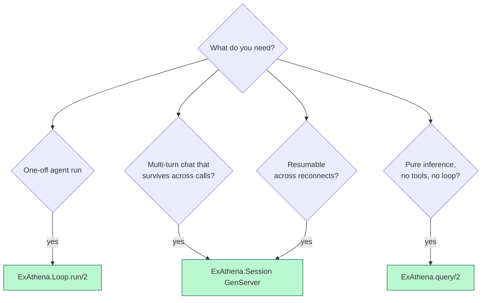
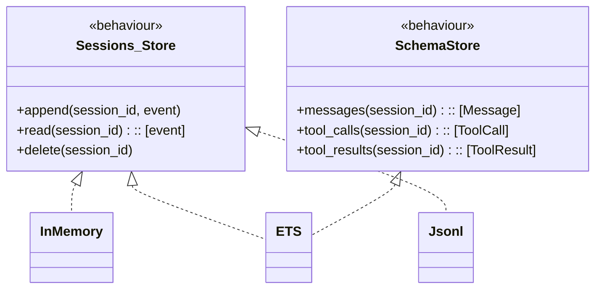
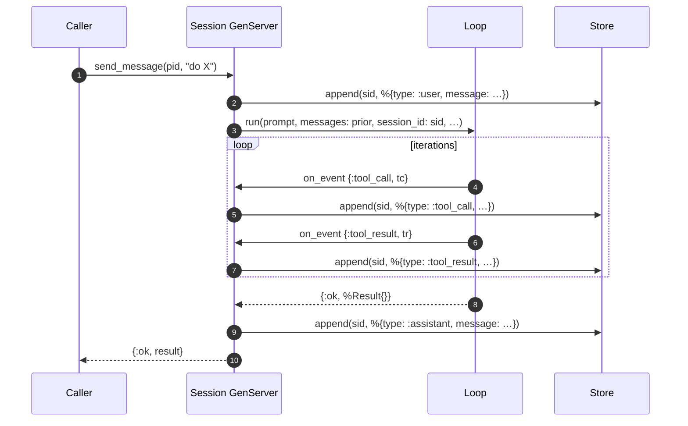
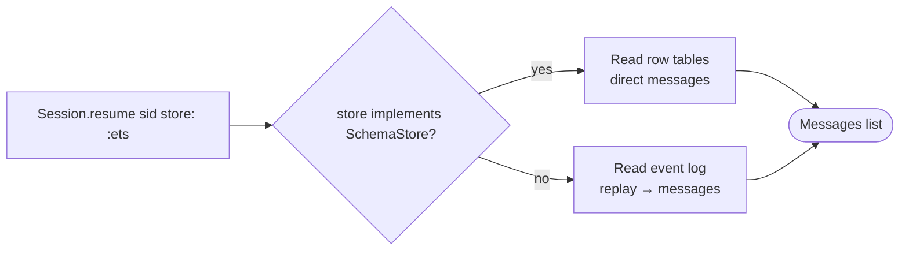
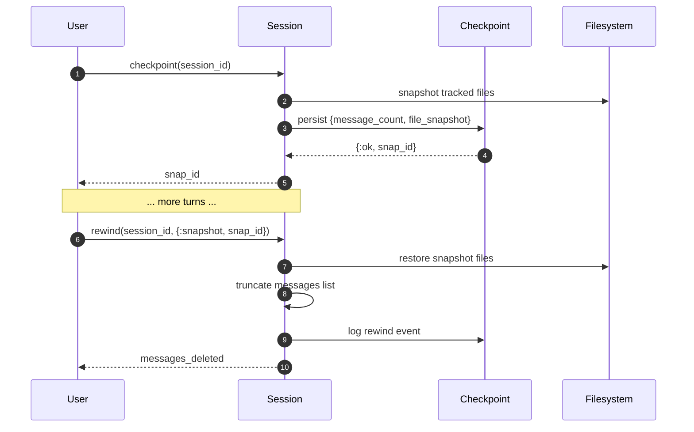

# 11 · Sessions — Multi-Turn State

> **What this answers:** how does a long conversation work? How do `resume` and `rewind` and `checkpoint` fit together? When do I want a Session vs. raw `Loop.run`?
> **Audience:** consumers building chat apps; contributors maintaining stores.

---

## When to use what



| Entry point | Process? | History? | Resumable? |
|---|---|---|---|
| `ExAthena.query/2` | No | No | No |
| `ExAthena.Loop.run/2` | No | Within one run | No |
| `ExAthena.Session.start_link/1` | Yes (GenServer) | Across `send_message` calls | Via store + `resume/2` |

---

## Session lifecycle

```mermaid
stateDiagram-v2
  [*] --> Idle
  Idle: GenServer up<br/>messages: [],
  Idle --> Running: send_message
  Running: Loop.run inside handle_call<br/>append to messages
  Running --> Idle: result returned
  Idle --> Rewound: rewind to checkpoint
  Rewound: messages truncated<br/>files restored
  Rewound --> Running: send_message
  Idle --> Stopped: stop
  Stopped --> [*]
```



Source: [`lib/ex_athena/session.ex`](../lib/ex_athena/session.ex). Each `send_message`:

1. Appends the user message.
2. Calls `Loop.run/2` with the full current history + session opts.
3. Persists every event (user message, assistant message, tool calls, tool results) via the configured `Sessions.Store`.
4. Returns `{:ok, %Result{}}`.

The session process owns the message list. Concurrent `send_message` calls are serialised by the GenServer.

---

## Stores



Sources:
- Behaviour: [`Sessions.Store`](../lib/ex_athena/sessions/store.ex)
- Row-table extension: [`Sessions.SchemaStore`](../lib/ex_athena/sessions/schema_store.ex)
- Backends: [`Sessions.Stores.InMemory`](../lib/ex_athena/sessions/stores), [`Sessions.Stores.ETS`](../lib/ex_athena/sessions/stores), [`Sessions.Stores.Jsonl`](../lib/ex_athena/sessions/stores)

| Store | Persists where | Survives restart? | Schema (row tables)? | Best for |
|---|---|---|---|---|
| `:in_memory` | Process state | No | No | Tests, ephemeral one-shot UIs |
| `:ets` | ETS table | No (in-VM only) | ✅ | Single-node dev / single-VM Phoenix LiveView |
| `:jsonl` | JSONL file on disk | ✅ | No | CLI sessions, debugging, archival |
| custom module | Wherever you implement | ✅ if your impl is | Optional | DB-backed, multi-node, Ash-backed, etc. |

When the store implements `SchemaStore`, `resume/2` reads from row tables directly (fast). Otherwise, it replays the event log.

---

## send_message → store interaction



The session's `:on_event` callback bridges Loop events into store appends, so the persisted log captures every step (not just the final messages).

---

## Resume

```elixir
{:ok, msgs} = ExAthena.Session.resume(session_id, store: :ets)
{:ok, pid}  = ExAthena.Session.start_link(
  provider: :claude,
  messages: msgs,
  session_id: session_id,
  store: :ets
)
```



Pass `as: :raw` to get the raw event log instead of materialised messages — useful for forensics. See `Session.resume/2`.

---

## Checkpoints + rewind

A **checkpoint** is a snapshot:

- File system: a list of file paths + their current content (via [`ExAthena.Checkpoint`](../lib/ex_athena/checkpoint.ex)).
- Conversation: the index of the last persisted message at the time the snapshot was taken.



Source: [`Session.checkpoint/1`](../lib/ex_athena/session.ex), [`Session.rewind/3`](../lib/ex_athena/session.ex). The [`Storage.Sweeper`](../lib/ex_athena/storage/sweeper.ex) prunes old snapshots — and old session transcripts — at boot.

> Snapshots beyond the rewind anchor are deliberately kept as potential redo targets; no separate redo API exists in v1.

Cross-link: [`guides/sessions_and_checkpoints.md`](../guides/sessions_and_checkpoints.md) — practical recipes, sidechain transcripts, multi-node concerns.

---

## Sidechain transcripts (subagents)

When a session spawns a subagent via `Tools.SpawnAgent`, the child loop's events stream into a *sidechain* under the parent's `session_id`. Stores that support multi-stream (e.g. `Jsonl`) keep these separate; others log them inline with a `parent_session_id` tag.

See [13 · Agents & subagents](13-agents-and-subagents.md).

---

## Configuration cheat sheet

```elixir
# CLI / dev — durable, inspectable
ExAthena.Session.start_link(provider: :claude, store: :jsonl, jsonl_dir: "~/.exathena/sessions")

# Phoenix LiveView — fast, in-VM
ExAthena.Session.start_link(provider: :ollama, store: :ets, name: {:via, Registry, {SessionRegistry, sid}})

# Tests — no persistence
ExAthena.Session.start_link(provider: :mock, store: :in_memory)
```

---

## Contributor notes

- **Sessions own messages; Loop owns iteration**: never reach into the GenServer state from the Loop. The session passes a snapshot of messages in via `Loop.run` options and consumes the result.
- **Store append order matters**: the Jsonl backend depends on temporal ordering for replay. Always append in the order events fired.
- **Dual-write to row tables**: when the store implements `SchemaStore`, the session updates *both* the event log and the row tables on each append. Read paths prefer rows. Tests verify both stay in sync.
- **`session_id` is stable across resume**: the same id can be used to resume an existing session. The GenServer pid is *not* — generate a fresh pid each time you resume, then register it under `{:via, Registry, …}` if you want a stable lookup.
- **Subagent storage**: subagent transcripts use `parent_session_id` to scope. Don't merge them into the parent's main log without a discriminator.
- **Rewind is destructive of *forward state*, not of snapshots**: the snapshot list itself stays. Forward redo isn't implemented — if you want it, layer it on top by checkpointing again before each rewind.

---

## Where to go next

- [`guides/sessions_and_checkpoints.md`](../guides/sessions_and_checkpoints.md) — concrete recipes.
- [13 · Agents & subagents](13-agents-and-subagents.md) — sidechain transcripts.
- [03 · Reasoning loop](03-reasoning-loop.md) — what `Loop.run` actually does per `send_message`.
