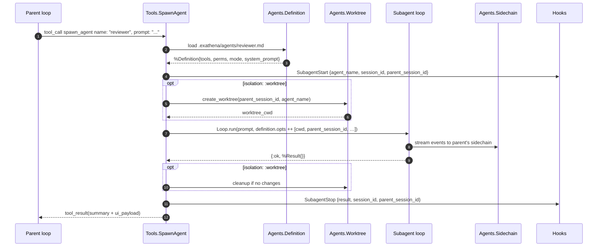
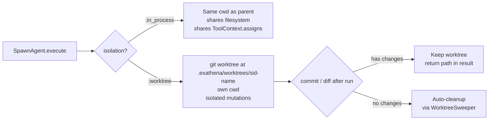
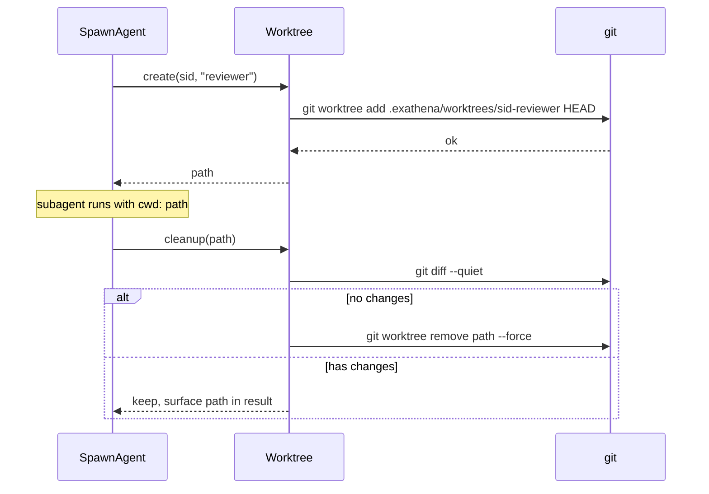
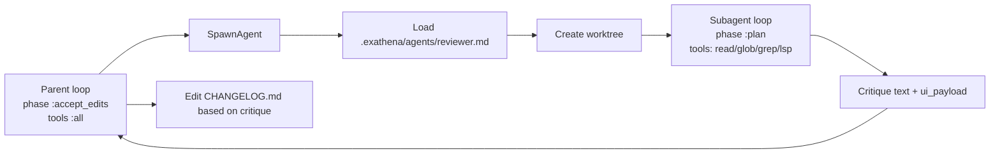

# 13 · Agents & Subagents — Composition

> **What this answers:** how does one agent spawn another? How are subagent tools / permissions / mode chosen? How does worktree isolation work?
> **Audience:** consumers building multi-agent workflows; contributors maintaining `Tools.SpawnAgent` and worktree scaffolding.

---

## Spawning a subagent



Sources:
- Tool: [`Tools.SpawnAgent`](../lib/ex_athena/tools/spawn_agent.ex)
- Definition: [`Agents.Definition`](../lib/ex_athena/agents/definition.ex)
- Registry: [`Agents`](../lib/ex_athena/agents.ex)
- Worktree: [`Agents.Worktree`](../lib/ex_athena/agents/worktree.ex), [`Agents.WorktreeSweeper`](../lib/ex_athena/agents/worktree_sweeper.ex)
- Sidechain: [`Agents.Sidechain`](../lib/ex_athena/agents/sidechain.ex)

---

## Agent definitions

An agent lives as a Markdown file with YAML frontmatter:

```
.exathena/agents/reviewer.md
```

```yaml
---
name: reviewer
description: Strict code-review subagent. Read-only, narrow scope.
tools: [read, glob, grep, lsp]
phase: plan
mode: react
model: claude-sonnet-4-6
isolation: in_process
---

You are a code reviewer. Read the diff, identify issues, return a structured
critique. Never modify files. Be concise — one paragraph per issue.
```

The Markdown body becomes the subagent's `system_prompt`. Frontmatter fields override the parent's `Loop.run` opts — within the guardrail bounds below.

---

## Guardrail inheritance — a child is never more privileged than its parent

`Tools.SpawnAgent` clamps every spawn (model-initiated *and* the orchestrate
runtime's auto-delegation) against the parent run's effective settings.
Agent definitions and model-supplied args may **narrow** these; nothing they
say can **widen** them:

| Setting | Combination rule |
|---|---|
| `allowed_roots` / `confine` | A confined parent confines every child. Requested roots survive only if they lie inside a parent root (intersection); otherwise the child gets the parent's roots. The child loop still cwd-anchors its roots, so a worktree-isolated child can reach its own worktree — host-controlled, never model-controlled. |
| `disallowed_tools` | Union of parent's and child's — a deny anywhere stays a deny. |
| `allowed_tools` | Intersection when both exist; parent's list when only the parent has one. |
| `can_use_tool` | Inherited from the parent unless the host already supplied one in `spawn_agent_opts` (the host is trusted; the model cannot set this). |
| `phase` | Clamped to the more restrictive of parent's and requested (`:plan` < `:default` < `:accept_edits` < `:trusted` < `:bypass_permissions`). A `:plan` parent only ever spawns `:plan` children; a definition may still narrow (`:default` parent → `permissions: plan` child). Unknown phase atoms are treated as maximally permissive, so they always lose to the parent's phase. |
| `hooks` | Only the parent's **`PreToolUse`** groups are inherited (they are part of the permission gate, so the parent's deny hooks protect subagent tool calls too). Other hook events are deliberately not inherited — they may assume parent context (Stop hooks persisting parent session state, SessionEnd cleanup). Hosts wanting more can pass a full hooks table via `spawn_agent_opts[:hooks]`. |

Source: `inherit_guardrails/2` in [`Tools.SpawnAgent`](../lib/ex_athena/tools/spawn_agent.ex); phase ranking in [`Permissions.most_restrictive_phase/2`](../lib/ex_athena/permissions.ex). The parent's guardrails reach the tool via `ToolContext` (`allowed_roots`, `phase`) and `assigns[:run_permissions]` (set by `Loop.run` for every run, so the clamp recurses correctly for grandchildren).

Source: [`Agents.Definition`](../lib/ex_athena/agents/definition.ex). The loader is in [`Agents.load!/2`](../lib/ex_athena/agents.ex).

### Recognised frontmatter

| Field | Effect |
|---|---|
| `name` | The string the parent uses in `spawn_agent` calls. |
| `description` | One-liner shown in the parent's tool catalog. |
| `tools` | List of tool names the subagent may use. |
| `phase` | One of `:plan / :default / :accept_edits / :trusted / :bypass_permissions`. |
| `mode` | `:react / :plan_and_solve / :reflexion` (or a custom module name). |
| `model` | Provider model override (defaults to parent's). |
| `provider` | Override the provider altogether. |
| `isolation` | `:in_process` (default) or `:worktree`. |
| `max_iterations` | Per-subagent cap. |
| `max_budget_usd` | Per-subagent budget. |
| `disallowed_tools`, `allowed_tools` | Per-subagent permission lists. |

---

## Isolation modes



### `:in_process` (default)

Cheap. Subagent runs in the same process tree, same `cwd`. Tools see the same filesystem; mutations are immediately visible to the parent.

Best for: investigations, summarisations, anything read-only or whose writes the parent wants visible immediately.

### `:worktree`

Source: [`Agents.Worktree.create/2`](../lib/ex_athena/agents/worktree.ex). Calls `git worktree add` rooted at `.exathena/worktrees/<sid>-<agent_name>` and points the subagent's `ctx.cwd` there.



Best for: multi-agent workflows where each agent should mutate independently, then the parent decides which changes to merge.

Cross-link: [`guides/agents_subagents.md`](../guides/agents_subagents.md) — pattern recipes and worktree pitfalls.

---

## Sidechain transcripts

The subagent's full transcript (every prompt, tool call, response, finish reason) is streamed to the parent's sidechain — under `parent_session_id` in the configured store.

Stores that natively support multi-stream (e.g. `Jsonl` writing to a sub-file) keep these isolated. Others tag every event with `parent_session_id` and discriminate on read.

Source: [`Agents.Sidechain`](../lib/ex_athena/agents/sidechain.ex).

The parent doesn't *see* sidechain events in its message history (only the final summary tool_result). But debug UIs and post-hoc auditing can pull the full subagent trace.

---

## A worked example

```elixir
# Parent
ExAthena.run("Review the diff in PR-123, then update the changelog accordingly",
  provider: :claude,
  phase: :accept_edits,
  tools: :all,
  cwd: "/path/to/repo"
)
```

Parent emits a `spawn_agent` tool call:

```json
{
  "name": "reviewer",
  "prompt": "Review the diff between origin/main and HEAD. Return: severity, file:line, suggested fix."
}
```



The subagent is read-only (`phase: :plan`), uses a different model, and reports back. The parent stays in `:accept_edits` and applies the edits.

---

## Contributor notes

- **`SpawnAgent` is `parallel_safe?: true`**: a parent can spawn multiple subagents concurrently. They run in separate processes (the Loop is reentrant) under `Task.async_stream`.
- **No infinite nesting**: the parent's `parent_session_id` becomes the subagent's grandparent if it itself spawns. Track depth in `meta` if you want to limit nesting (the kernel doesn't impose a depth cap).
- **Worktree git safety**: `Agents.Worktree.create/2` refuses to create a worktree on a dirty branch (uncommitted changes) by default. Tests cover the safety checks. Don't bypass them.
- **Hooks on subagents**: only the parent's `PreToolUse` groups are inherited (see "Guardrail inheritance" above) — they gate tool calls, so dropping them would let a worker bypass the parent's deny hooks. All other hook events are *not* inherited: subagents shouldn't be implicitly bound to parent-specific side effects (Stop/SessionEnd hooks often assume parent context). Pass a hooks table via `spawn_agent_opts[:hooks]` to opt in explicitly.
- **Budget accounting**: the subagent's `usage` and `cost_usd` accrue against the parent? No — they're separate `Result`s. The parent sees the subagent's cost in the `ui_payload` returned by SpawnAgent. Tally externally if you want a top-level number.
- **Cleanup is best-effort**: `WorktreeSweeper` is a GenServer that purges stale worktrees (no associated session, older than threshold). Don't rely on `SpawnAgent.cleanup` alone — crashes leave worktrees that the sweeper picks up later.

---

## Where to go next

- [`guides/agents_subagents.md`](../guides/agents_subagents.md) — full recipe book.
- [11 · Sessions](11-sessions.md) — sidechain transcripts and parent linkage.
- [08 · Permissions](08-permissions.md) — phase overrides per subagent.
- [09 · Hooks](09-hooks.md) — `SubagentStart` / `SubagentStop` events.
