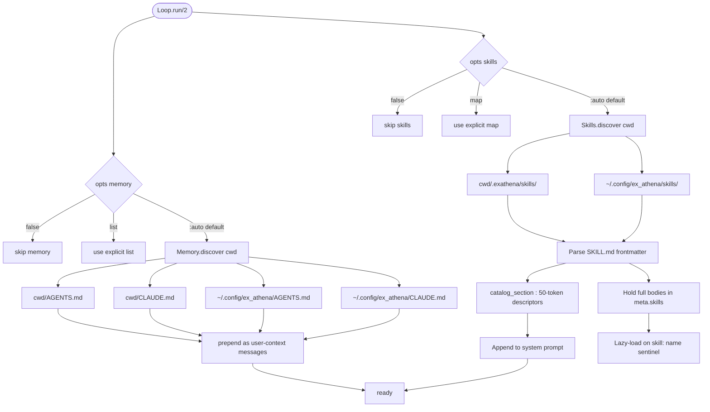
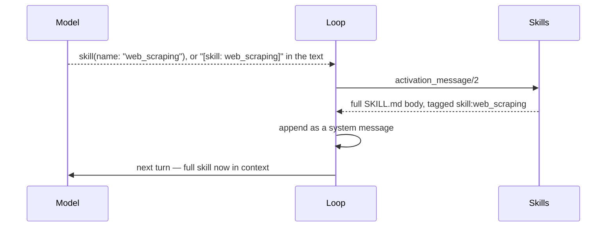
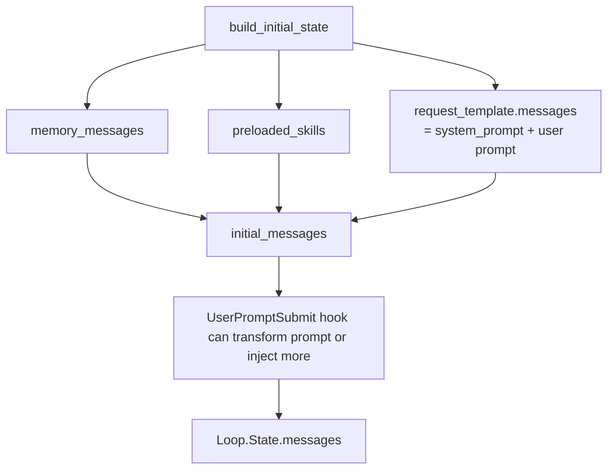

# 14 · Memory & Skills — File-Based Context

> **What this answers:** how do `AGENTS.md` / `CLAUDE.md` / `SKILL.md` get into the conversation? When are skills loaded vs just advertised?
> **Audience:** consumers structuring project context; contributors maintaining discovery.

---

## The discovery pipeline



Sources:
- Discovery: [`ExAthena.Memory.discover/1`](../lib/ex_athena/memory.ex), [`ExAthena.Skills.discover/1`](../lib/ex_athena/skills.ex)
- Wiring: [`Loop.resolve_memory/2`](../lib/ex_athena/loop.ex#L655), [`Loop.resolve_skills/2`](../lib/ex_athena/loop.ex#L663), [`Loop.apply_skills_catalog/2`](../lib/ex_athena/loop.ex#L671)

---

## Memory — `AGENTS.md` / `CLAUDE.md`

The full content of these files is **prepended to the conversation as `user` messages** before the actual user prompt. They establish project context, conventions, and rules the model should follow.

Discovery order:

1. `<cwd>/AGENTS.md`
2. `<cwd>/CLAUDE.md`
3. `~/.config/ex_athena/AGENTS.md`
4. `~/.config/ex_athena/CLAUDE.md`

All files found are concatenated in this order. Both names are recognised; `AGENTS.md` is the convention; `CLAUDE.md` is supported for compatibility.

### Override per-run

```elixir
# Skip memory entirely
ExAthena.run(prompt, memory: false)

# Provide explicit messages
ExAthena.run(prompt, memory: [Messages.user("repo-specific rules here")])

# Default — auto discovery
ExAthena.run(prompt)   # implicitly memory: :auto
```

---

## Skills — `SKILL.md`

Skills are **lazy-loaded capabilities**. ExAthena advertises a short descriptor in the system prompt and reveals the full body only when the model asks for it — by calling the `skill` tool, or by writing a `[skill: name]` sentinel in its response.

This keeps the system prompt small (~50 tokens per skill) regardless of how many skills exist, while still making every one discoverable.

### Skill file layout

```
.exathena/skills/web_scraping/SKILL.md
```

```yaml
---
name: web_scraping
description: How to fetch and parse web pages — includes selectors for common sites.
---

When you need to fetch a web page:

1. Use `web_fetch` to get the raw HTML.
2. Parse with `LazyHTML.from_document/1` then `LazyHTML.filter/2`.
3. For paginated content, …
```

### Catalog section (added to system prompt)

```text
## Available Skills

Call the `skill` tool with a skill's name to load its full instructions, before you start the work it covers.

  - `web_scraping` — How to fetch and parse web pages — includes selectors for common sites.
  - `linear_api` — Authenticated Linear API patterns.
```

About 50 tokens per skill thanks to the description budget.

The catalog names one mechanism: the `skill` tool when the run granted it, the sentinel when it did not. The sentinel keeps working either way — it is the fallback for providers with no native tool calls — but a catalog offering two ways to do one thing invites the weaker one.

### Lazy loading



Source: [`ExAthena.Skills`](../lib/ex_athena/skills.ex), [`ExAthena.Tools.Skill`](../lib/ex_athena/tools/skill.ex). Both entry points end at `activation_message/2`, so the body arrives identically whichever asked for it and `loaded_skills/1` counts it once — naming the same skill by tool and by sentinel loads it one time.

Two things the tool does not do: it does not return the body itself (the loop attaches it, as `plan_mode` has the loop apply its phase change), and it does not load a skill marked `disable-model-invocation` — neither does the sentinel. `preload/3` still can: the host is not the model.

An unknown name comes back as a tool error listing the names that do exist, so the model corrects itself instead of giving up on skills. Issue 247 has the session where it gave up: two unknown-tool errors for `skill: architecture-brief-and-mocks`, then the work done from the one-line descriptions alone.

### Preload skills

If you know a skill will be needed up front, skip the round-trip entirely:

```elixir
ExAthena.run(prompt, preload_skills: ["web_scraping"])
```

Source: [`Loop.run/2`](../lib/ex_athena/loop.ex#L70), [`Skills.preload/3`](../lib/ex_athena/skills.ex).

### Override skills

```elixir
# Skip skills
ExAthena.run(prompt, skills: false)

# Explicit map
ExAthena.run(prompt, skills: %{
  "my_skill" => %ExAthena.Skills.Skill{name: "my_skill", description: "…", body: "…"}
})

# Default
ExAthena.run(prompt)   # implicitly skills: :auto
```

---

## Where memory + skills end up in the message list



Order matters: memory first (project-level rules), then preloaded skills, then the request template (system prompt + user prompt). `UserPromptSubmit` hooks fire last and may transform the final user message.

The skills *catalog* (~50 tokens per skill) ends up in the **system prompt**, not as a user message. Only full skill bodies that get loaded (preload or sentinel) live as user-context messages.

Source: [`Loop.build_initial_state/2`](../lib/ex_athena/loop.ex#L493).

---

## Cross-link

[`guides/memory_and_skills.md`](../guides/memory_and_skills.md) — file-format details and the sentinel parser.

---

## Contributor notes

- **`AGENTS.md` vs `CLAUDE.md`**: both names recognised; pick one per repo. ExAthena treats them identically. `AGENTS.md` is the convention.
- **No magic in memory files**: they're plain Markdown. No frontmatter, no execution.
- **Skill bodies are *user* messages, not system**: the system prompt is reserved for catalog descriptors. This keeps the prompt small and lets the model recall skills later via the message log.
- **Skill names must be unique**: cwd skills override `~/.config/ex_athena/skills/` of the same name. Discovery merges with cwd winning.
- **50-token budget for descriptions**: descriptions get truncated when they exceed the budget. Keep them tight.
- **Preload sparingly**: preloading every skill defeats the lazy-load mechanism. Only preload if you know the model needs it from turn 1.
- **`meta.skills` vs `meta.preloaded_skill_count`**: full skills catalog lives in `meta.skills`; the count of preloaded ones is in `meta.preloaded_skill_count`. The Compactor knows about both for pinning math.

---

## Where to go next

- [`guides/memory_and_skills.md`](../guides/memory_and_skills.md) — file-format details.
- [12 · Compaction](12-compaction.md) — how pinned prefix accounting interacts with memory + preloaded skills.
- [03 · Reasoning loop](03-reasoning-loop.md) — where `build_initial_state` assembles the initial messages.
