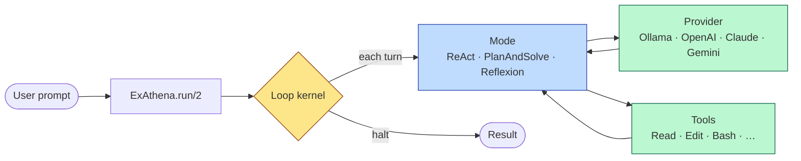

# ExAthena — How It Thinks

> Diagram-driven walkthrough of the full reasoning logic of `ex_athena`.
> Companion to [`guides/`](../guides) (feature how-tos) and [`adr/`](../adr) (design decisions).

**What you'll find here:** a layered, Mermaid-diagrammed explanation of *how a prompt becomes an answer* — every decision the loop makes, every subsystem it touches, every way it can end.

---

## The 10-second mental model

Three layers do the work:

| Layer | Role | Key modules |
|---|---|---|
| **Kernel** | Drives iterations, enforces caps, threads state, classifies termination. | [`ExAthena.Loop`](../lib/ex_athena/loop.ex), [`Loop.State`](../lib/ex_athena/loop/state.ex), [`Loop.Terminations`](../lib/ex_athena/loop/terminations.ex) |
| **Strategy (Mode)** | Decides *what to do this turn* — call provider, parse tool calls, halt or continue. | [`Loop.Mode`](../lib/ex_athena/loop/mode.ex), [`Modes.ReAct`](../lib/ex_athena/modes/react.ex), [`Modes.PlanAndSolve`](../lib/ex_athena/modes/plan_and_solve.ex), [`Modes.Reflexion`](../lib/ex_athena/modes/reflexion.ex) |
| **Drivers** | Talk to LLMs, run tools, gate permissions, fire hooks. | [`Provider`](../lib/ex_athena/provider.ex), [`Tool`](../lib/ex_athena/tool.ex), [`Permissions`](../lib/ex_athena/permissions.ex), [`Hooks`](../lib/ex_athena/hooks.ex) |

---

## Audience — read in this order

### If you're a **consumer** using `ExAthena.run` / `Session` in your app

1. **[01 · Mental model](01-mental-model.md)** — the one-pager.
2. **[18 · End-to-end traces](18-end-to-end-traces.md)** — see real turns play out.
3. **[17 · Error recovery](17-error-recovery.md)** — what each finish reason means + what to do.
4. **[07 · Tools](07-tools.md)**, **[08 · Permissions](08-permissions.md)**, **[09 · Hooks](09-hooks.md)** — the three knobs you'll touch most.

### If you're a **contributor** modifying the loop, modes, or internals

1. **[02 · Architecture](02-architecture.md)** — subsystem map.
2. **[03 · Reasoning loop](03-reasoning-loop.md)** — kernel mechanics.
3. **[04 · Modes](04-modes.md)** — the strategy plug-in point.
4. **[05 · State & termination](05-state-and-termination.md)** — invariants.
5. Then read each subsystem deep-dive (06 → 16) in any order.

---

## Full index

| # | Document | What it answers |
|---|---|---|
| 01 | [Mental model](01-mental-model.md) | What's the one-page picture of a turn? |
| 02 | [Architecture](02-architecture.md) | What are the subsystems and how do they fit? |
| 03 | [Reasoning loop](03-reasoning-loop.md) | How does the kernel drive `Mode.iterate/1`? What happens between turns? |
| 04 | [Modes](04-modes.md) | How do ReAct / Plan-and-Solve / Reflexion differ? |
| 05 | [State & termination](05-state-and-termination.md) | What's in `Loop.State`? What are the 13 finish reasons? |
| 06 | [Messages & tool calls](06-messages-and-tool-calls.md) | What does the conversation look like in memory? How are tool calls parsed? |
| 07 | [Tools](07-tools.md) | How does a tool execute? What's parallel-safe? |
| 08 | [Permissions](08-permissions.md) | How does the deny-first gate work? What are the 5 phases? |
| 09 | [Hooks](09-hooks.md) | When do the 18 events fire? What can each return? |
| 10 | [Providers](10-providers.md) | How does ExAthena talk to Ollama / OpenAI / Claude / Gemini uniformly? |
| 11 | [Sessions](11-sessions.md) | How does multi-turn chat work? How does resume / rewind work? |
| 12 | [Compaction](12-compaction.md) | How does ExAthena keep the context window from overflowing? |
| 13 | [Agents & subagents](13-agents-and-subagents.md) | How does one agent spawn another with isolated tools / worktree? |
| 14 | [Memory & skills](14-memory-and-skills.md) | How are `AGENTS.md` / `CLAUDE.md` / `SKILL.md` consumed? |
| 15 | [MCP & LSP](15-mcp-and-lsp.md) | How are external tool servers / language servers integrated? |
| 16 | [Structured output](16-structured-output.md) | How does schema-validated extraction work? |
| 17 | [Error recovery](17-error-recovery.md) | Per finish reason: what does it mean + what should the caller do? |
| 18 | [End-to-end traces](18-end-to-end-traces.md) | Annotated sequence diagrams of real turns. |

---

## Glossary

- **Loop** — the kernel (`ExAthena.Loop`) that runs iterations until a termination fires.
- **Mode** — pluggable per-turn strategy. Default `ReAct`; alternatives `PlanAndSolve`, `Reflexion`. See [04](04-modes.md).
- **State** — opaque `Loop.State` struct threaded through every iteration. See [05](05-state-and-termination.md).
- **Termination / finish reason** — one of 12 typed reasons in `Loop.Terminations`. Every run ends with exactly one. See [05](05-state-and-termination.md), [17](17-error-recovery.md).
- **Tool** — stateless module implementing `ExAthena.Tool` behaviour. See [07](07-tools.md).
- **Hook** — callback fired at one of 18 lifecycle events. See [09](09-hooks.md).
- **Permission gate** — deny-first check (`disallow → allow → phase → callback`) before every tool. See [08](08-permissions.md).
- **Provider** — adapter to an LLM endpoint. See [10](10-providers.md).
- **Session** — GenServer wrapping the Loop for multi-turn chat. See [11](11-sessions.md).
- **Compaction** — 5-stage pipeline that reduces conversation history when it approaches the context limit. See [12](12-compaction.md).
- **Agent / subagent** — named composable LLM workflow; can be spawned from a parent agent with isolated tools / worktree. See [13](13-agents-and-subagents.md).
- **Skill** — file-based capability (`SKILL.md`) lazily activated by the `skill` tool or the `[skill: name]` sentinel. See [14](14-memory-and-skills.md).

---

## Conventions in this folder

- Every doc opens with at least one **Mermaid diagram**. GitHub renders these natively.
- Code references use clickable paths like [`lib/ex_athena/loop.ex:147`](../lib/ex_athena/loop.ex#L147).
- Cross-links to existing material in [`guides/`](../guides) and [`adr/`](../adr) are *links, not duplications*.
- Each feature doc ends with a **Contributor notes** section covering invariants, edge cases, and non-obvious behavior.
